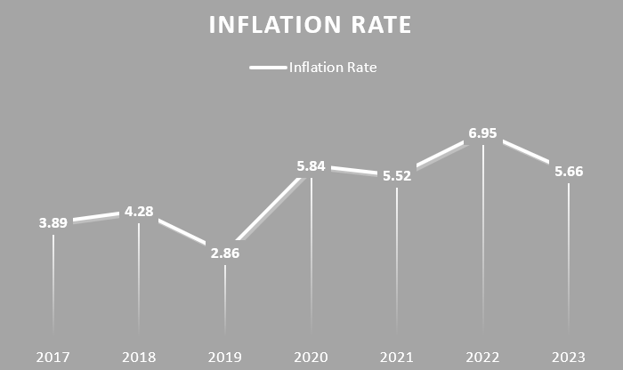

# 📊 CPI & Inflation Dashboard (India, 2017–2023)

## Overview

Inflation impacts every household, every business, and every policy decision — but the numbers behind it often go unnoticed. This project brings those numbers to life.

Using Consumer Price Index (CPI) data from India between 2017 and 2023, I built an Excel dashboard to explore **how prices have shifted**, **which categories drove inflation**, and **when key spikes occurred**.

## 🎯 Objective

To simplify complex economic data into an **interactive Excel dashboard** that reveals the trends and patterns in India’s inflation — with a special focus on **food**, **fuel**, and **core components**.

## 🔍 Key Insights

- 🥦 **Food & beverages played the biggest role in shaping CPI trends**, consistently contributing more than any other category. Their weight in the index makes them the primary driver of inflationary movements in India.

  

- 📈 **Inflation peaked in 2022**, largely driven by global supply shocks and rising fuel prices.

  
  
- 🍚 **Food inflation** remained volatile, especially during and after the pandemic.
- 🛢️ **Fuel & light** showed the sharpest price hikes post-2020, contributing heavily to overall CPI growth.
- 📊 **Core CPI (excluding food & fuel)** remained more stable, helping differentiate temporary vs. persistent inflation.

## 🛠️ Tools Used

- **Microsoft Excel**
  - Pivot tables
  - Slicers and drop-down filters
  - Conditional formatting & charts

## 🗂️ Dataset

The data was sourced from **official Indian government CPI publications** and cleaned for analysis. It includes monthly price indices across major categories from **Jan 2017 to Sep 2023**.

## 🧭 Why This Matters

Understanding inflation isn't just for economists — it affects our daily decisions. This dashboard provides a **clear, visual narrative** of how different categories influenced the cost of living in India over six years.
